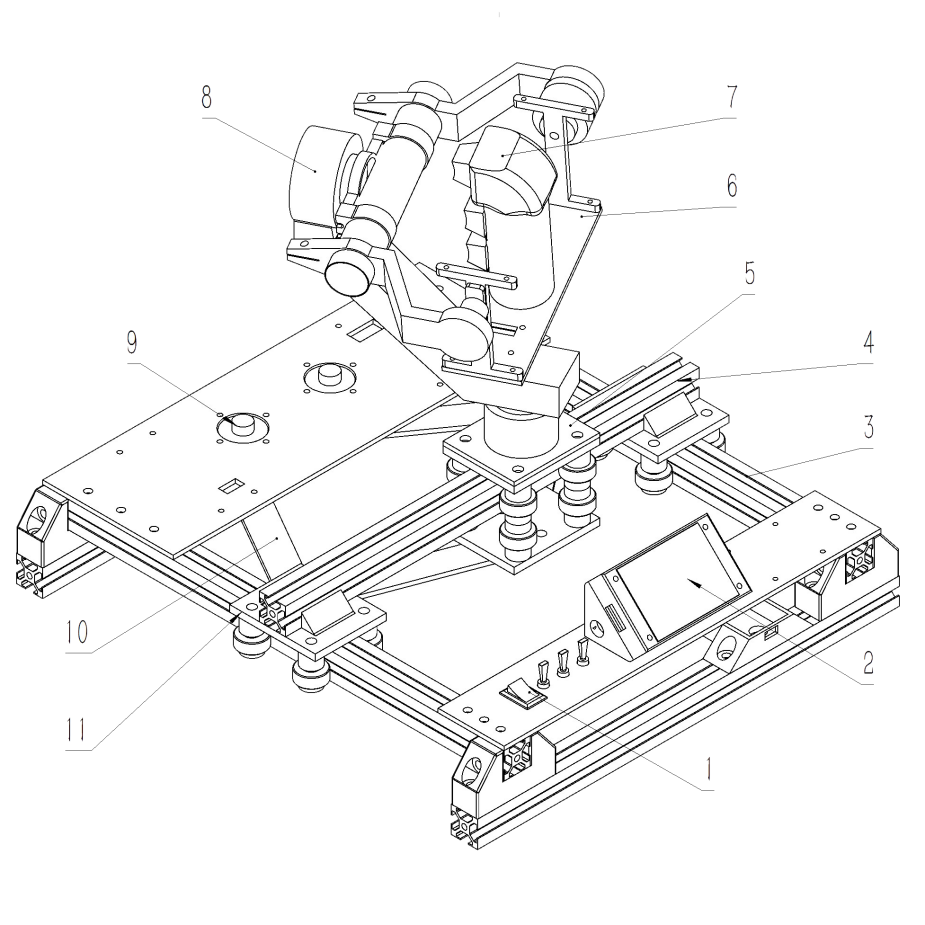

# Movexy

五轴交互控制器

## 结构设计

图1 结构示意图

1-总开关；2-显示屏；3-Y轴铝型材支撑；4-X轴铝型材支撑；5-中心滑台；6-云台手托底座；7-按键手柄；8-Roll轴旋转电机；9-编码电机；10-五连杆机构；11-水平滑台

 

图2 底层结构示意图（下视图）

1-编码电机；2-主动杆；3-从动杆；4-法兰轴承；5-深沟球轴承；6-塞打螺栓

 

图3 三轴摇杆结构示意图

1-模拟按键；2-手柄握把；3-陀螺仪传感器；4-旋转电机；5-固定底座；6-Roll轴旋转电机；7-抱紧环；8-抱紧摇臂；9-支撑管；10-支撑架

## 工作原理

​		通过底座的编码电机可实时监测主动连杆的角度变化，通过运动学推算便可以得到五连杆机构关于末端位置与主动连杆角度的数学关系，当操控者手持操控手柄进行位置移动时，便可以通过编码电机的角度解算出末端位置的水平xy坐标，通过设置不同坐标对应的控制信号便可达到自定义操控逻辑的效果。除此之位，本发明采用编码电机并非完全的编码器，这也就以意味着我们的连杆机构是可以进行反向驱动的，由于我们得到了五连杆机构的运动学关系，便可以解算出连杆各个角度的实际值，我们通过数学关系求解五连杆机构的雅可比矩阵，便可以将我们为了反驱需要末端位置的水平输出力矩转化为两个电机的输出力矩，再通过PID等控制器便可以实现末端位置主移动的效果。在机器人交互领域，力反馈操控能够让操控者实时感知机器人的受力状态，本作品的力矩控制便可以达到这中效果。

### 3轴摇杆解算：

操控者通过手握操作手柄可以实现yaw，pitch，roll三轴的自由转动，通过搭载的陀螺仪模块可以实时监测手柄在空间中的三维姿态，便可以利用这个信息将我们姿态实时同步到被操控的机器人或设备中，实现同步现实的功能。与此同时，3轴摇杆的转动也可以通过电机进行反向驱动，也可以实现上述力矩反馈控制的效果，大大提高操作者的操作体验和提升机器人操控过程中的安全性。

### 软件设计：

主控台下方搭载了STM32和ESP32两块单片机和一块串口屏幕。STM32单片机主要通过运行的FreeRTOS系统同时承担运动解算和控制，通过CAN通讯获取电机数据和驱动电机，通过串口获得陀螺仪数据，在STM32单片机里进行运动学解算。解算信息通过串口发给ESP32单片机，并再由其转发到串口屏幕上实时显示解算信息，同时ESP32可以通过蓝牙或串口模拟键盘鼠标或者向上位机发送数据信息，在由上位机转发给被操控对象，便可以进行操控作业。

## 效果演示

[实验室大揭秘! 神秘设备究竟是什么?_哔哩哔哩_bilibili](https://www.bilibili.com/video/BV1snhEecEuS/?spm_id_from=333.999.0.0&vd_source=e80c8eeb96287959ad54c2ac2259ae65)

@125yueyuanhanoo